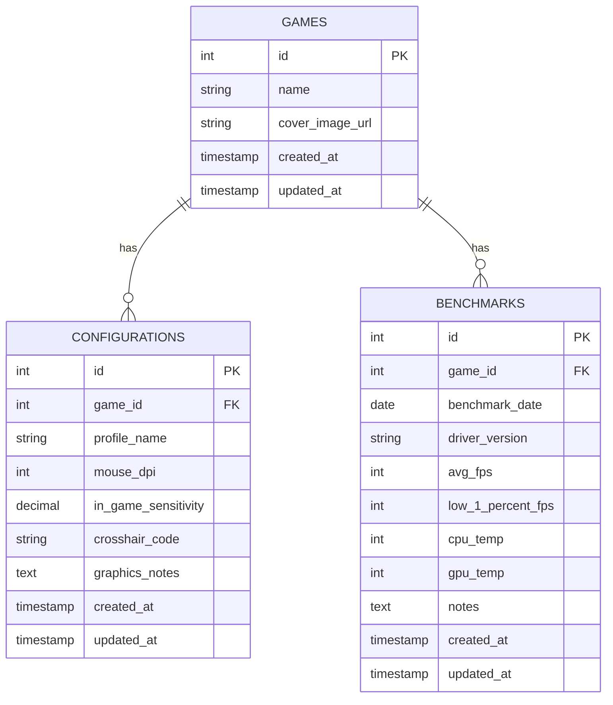
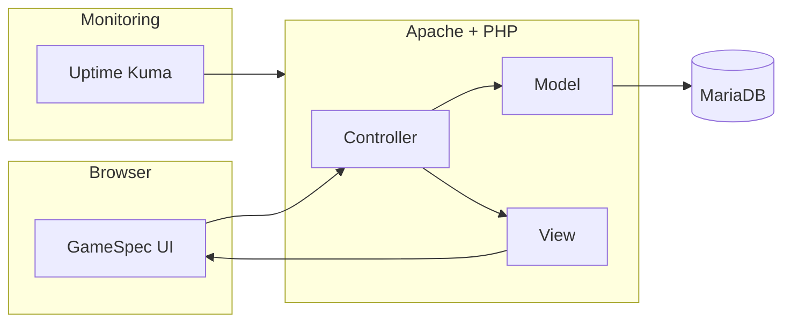
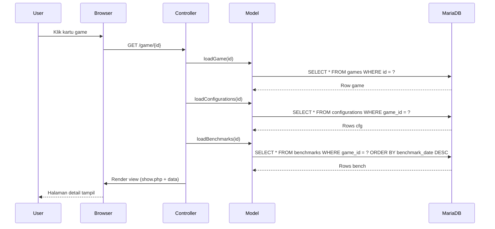

# GameSpec Tracker

> Aplikasi web self‑hosted untuk mencatat & menganalisis konfigurasi permainan (game settings) dan data performa hardware (benchmark) per game.

## Daftar Isi
1. Ringkasan Proyek
2. Fitur Utama (Mapping ke SRS)
3. Arsitektur & Tech Stack
4. Evolusi Implementasi (Tahapan)
5. Struktur Direktori
6. Skema Basis Data
7. Diagram (Mermaid)
8. Alur Request (Sequence)
9. Panduan Menjalankan (Docker & Manual)
10. Migrasi / Setup Database
11. Penjelasan Fungsional Detail
12. UX & Aksesibilitas
13. Persistensi State Frontend
14. Keamanan & Praktik Lanjutan (Rencana)
15. Roadmap / Next Steps
16. Lisensi / Status

---
## 1. Ringkasan Proyek
GameSpec Tracker adalah aplikasi web ringan (PHP + MySQL/MariaDB) yang membantu gamer PC mendokumentasikan:
- Kumpulan game dimiliki / dimainkan.
- Beberapa profil konfigurasi (sensitivitas, DPI, crosshair, catatan grafis) per game.
- Riwayat benchmark (FPS, suhu, driver) untuk melacak dampak perubahan hardware / driver.

Aplikasi didesain untuk self‑host (VM / server pribadi) dengan antarmuka modern, responsif, mendukung mode gelap/terang dan fokus pada kecepatan.

## 2. Fitur Utama (Mapping ke SRS)
| Kode SRS | Fitur | Status | Catatan |
|----------|-------|--------|---------|
| REQ-FUNC-01 | CRUD Game | Implemented | Hapus cascade ke konfigurasi & benchmark. |
| REQ-FUNC-02 | CRUD Konfigurasi | Implemented | Form inline + halaman edit terpisah. |
| REQ-FUNC-03 | CRUD Benchmark | Implemented | Termasuk 1% low FPS & suhu. |
| UI-Theming | Dark/Light Theme | Implemented | Toggle dengan localStorage. |
| Search | Pencarian Game | Enhanced | Reactive (debounce) + highlight. |
| Filtering | Multi Filter | Implemented | Kombinasi chip (AND logic) + persistence. |
| Analytics | Grafik FPS | Implemented | Chart.js (Avg FPS & 1% Low). |
| Sorting | Client-side sort | Implemented | Nama, jumlah config, jumlah benchmark. |
| A11y | Live Regions | Implemented | Sort/filter/search announcements. |
| State Persist | Local Storage | Implemented | Sort mode, filters, theme, query. |

## 3. Arsitektur & Tech Stack
- Bahasa: PHP 8.1 (tanpa framework berat, pola mirip MVC).
- Web server: Apache (php:8.1-apache base image).
- Database: MariaDB 10.6 (kompatibel MySQL).
- Frontend: Server-rendered PHP + progressive enhancement (Vanilla JS + CSS variables).
- Visualisasi: Chart.js (CDN) untuk grafik FPS.
- Kontainer: Docker & docker-compose.
- Monitoring opsional: Uptime Kuma (sudah disertakan di compose). 
- Dependency eksternal seminimal mungkin untuk menjaga jejak ringan.

### Lapisan Logis
- Model: Kelas (Game, Configuration, Benchmark) (menggunakan PDO untuk query).
- Controller: Mengambil input (GET/POST), validasi dasar, memanggil model, passing data ke view.
- View: Templating sederhana PHP (layouts + partials), menambahkan elemen aksesibilitas.

## 4. Evolusi Implementasi (Tahapan)
1. Tahap 1 – Dasar CRUD Game + Router sederhana.
2. Tahap 2 – Konfigurasi: form inline, daftar, edit, delete.
3. Tahap 3 – Benchmark: form inline, riwayat, statistik sederhana, grafik FPS (Chart.js), filter tanggal.
4. Tahap 4 – UX & Visualisasi: Flash message, pencarian, router class, badge jumlah, perbaikan UI.
5. Tahap 5 – (Iteratif lanjutan yang dilakukan):
   - Header responsif dengan fokus aksesibilitas & scroll condensing.
   - Pengelompokan statistik di halaman game.
   - Multi filter + reactive search + highlight <mark>.
   - Penyimpanan preferensi (theme, filter, sort, query) di localStorage.
   - Peningkatan form edit (panel layout, keyboard shortcut, loading state).

## 5. Struktur Direktori (Ringkas)
```
cc-uts/
  docker-compose.yml
  Dockerfile
  README.md (ini)
  website/
    index.php         # Front controller
    setup.php         # Jalankan migrasi tabel
    database.sql      # Definisi skema
    db.php            # Koneksi PDO
    app/
      Core/           # (Autoloader, Router, Database helper, Flash helper)
      Models/         # Game.php, Configuration.php, Benchmark.php (diasumsikan)
      Controllers/    # GameController.php (mengelola semua entitas)
      Views/
        layouts/      # header.php, footer.php
        games/        # index.php, show.php, form.php, config_edit.php, bench_edit.php
    public/           # (opsional asset)
```

## 6. Skema Basis Data
Lihat `database.sql`. Ringkasan:
```
Tabel games
- id PK
- name VARCHAR(255) NOT NULL
- cover_image_url VARCHAR(500) NULL
- created_at, updated_at TIMESTAMP

Tabel configurations
- id PK
- game_id FK -> games.id (CASCADE)
- profile_name VARCHAR(255) NOT NULL
- mouse_dpi INT
- in_game_sensitivity DECIMAL(6,3)
- crosshair_code VARCHAR(255)
- graphics_notes TEXT
- created_at, updated_at

Tabel benchmarks
- id PK
- game_id FK -> games.id (CASCADE)
- benchmark_date DATE
- driver_version VARCHAR(100)
- avg_fps INT
- low_1_percent_fps INT
- cpu_temp INT
- gpu_temp INT
- notes TEXT
- created_at, updated_at
```

## 7. Diagram (Mermaid)
### 7.1 Entity Relationship


### 7.2 Component / Deployment (Sederhana)


### 7.3 Sequence: Akses Detail Game


## 8. Alur Request (Ringkas)
1. `index.php` menerima request, instansiasi Router.
2. Router mencocokkan path & method -> controller action.
3. Controller memproses input (GET/POST), panggil Model.
4. Model menjalankan query via PDO.
5. Data diteruskan ke View.
6. View + layout dirender -> HTML final.
7. Progressive JS menambah interaktivitas (sorting/filtering/search).

## 9. Panduan Menjalankan
### 9.1 Dengan Docker (Disarankan)
Prerequisite: Docker & Docker Compose.

Langkah:
1. Jalankan layanan:
```bash
docker compose up -d
```
2. Akses migrasi (sekali): `http://localhost:8000/setup.php` -> pesan sukses.
3. Buka aplikasi: `http://localhost:8000/`.
4. (Opsional) Monitoring: `http://localhost:3001/` (Uptime Kuma).

Perintah utilitas:
```bash
docker compose logs -f web
docker compose exec web php -v
docker compose exec db mariadb -uaquarise -p crud_db
```

### 9.2 Tanpa Docker (Manual Dev)
1. Install PHP >= 8.1 + ekstensi pdo_mysql.
2. Install MariaDB/MySQL & buat database `crud_db`.
3. Import `website/database.sql` atau jalankan `setup.php` via browser.
4. Pastikan `db.php` (host, user, password) sesuai lingkungan Anda.
5. Jalankan server built-in (opsional):
```bash
php -S localhost:8000 -t website
```
6. Buka `http://localhost:8000/`.

## 10. Migrasi / Setup Database
- Jalankan `setup.php` untuk eksekusi idempotent (CREATE TABLE IF NOT EXISTS).
- Alternatif: Import `database.sql` manual.
- Relasi memakai `ON DELETE CASCADE` untuk menjaga konsistensi.

## 11. Penjelasan Fungsional Detail
### Game
- Validasi: nama wajib.
- Cover URL opsional; fallback placeholder saat kosong.
- Penghapusan memicu cascade ke konfigurasi + benchmark.

### Konfigurasi
- Beberapa profil per game (use-case: setting ranked vs casual).
- Kombinasi numeric (DPI, sensitivity) + teks (notes, crosshair).
- Edit view terpisah memberikan ruang form lebih besar.

### Benchmark
- Menyimpan evolusi performa (driver, suhu, FPS).
- Grafik FPS: dua dataset (Avg & 1% Low) dengan gap handling.
- Filter tanggal (from/to) menyempitkan dataset.
- Statistik ringkasan: best / worst / latest / trend (di view detail).

## 12. UX & Aksesibilitas
Fokus utama:
- Chip filter bertipe toggle (aria-pressed) + live region untuk status.
- Search reaktif debounce (180ms) + highlight substring (<mark> tidak mengganggu screen reader).
- Navigasi header responsif: fokus trap di mobile, ESC untuk menutup.
- Theme toggle dengan preferensi tersimpan.
- Reduced motion: animasi diminimalkan jika user memilih preferensi.

## 13. Persistensi State Frontend
Disimpan via `localStorage`:
- `gstheme` -> light / dark.
- `gs_sort` -> mode sort (name|config|bench).
- `gs_filters` -> set filter aktif (serialized).
- `gs_search` -> query pencarian terakhir.
Pemulihan terjadi saat `DOMContentLoaded` sebelum apply filtering.

## 14. Keamanan & Praktik Lanjutan (Rencana)
Saat ini minimal (single-user). Untuk produksi multi-user:
- Sanitasi & escaping output lebih ketat (HTML entities sudah sebagian dilakukan di view).
- CSRF token untuk form mutasi.
- Rate limiting sederhana / auth session.
- Input validation server-side yang lebih kuat (filter_var, batas numeric, panjang text).
- Logging & audit trail (benchmark perubahan, siapa mengedit).
- Backup otomatis database (cron + dump).

## 15. Roadmap / Next Steps (Ide Tambahan)
- Sort direction toggle (A–Z / Z–A).
- Pagination / infinite scroll untuk ratusan game.
- Export CSV / JSON konfigurasi & benchmark.
- Autentikasi user & role (mis. read-only guest).
- Mode perbandingan benchmark antar tanggal.
- Tag / kategori game.
- Import library dari file eksternal.
- Badge "recently updated" (berdasar updated_at < X hari).
- API JSON ringan untuk integrasi eksternal.

## 16. Lisensi / Status
Proyek akademik / pembelajaran. Belum ditetapkan lisensi formal (default all-rights-reserved). .
